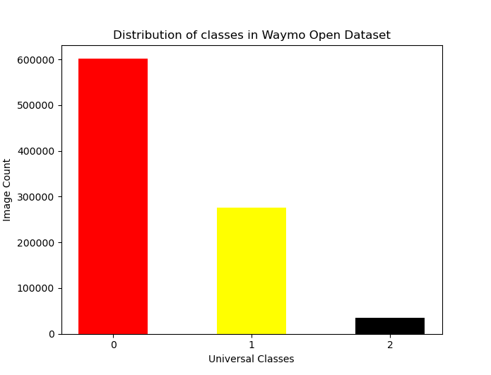

### Purpose
- Facilitating the generation of a custom dataset for 2D YOLO object detector training, and also integrating the famous 2D object detection datasets for object detection tasks in autonomous driving.

- Before training the YOLO 2D object detector, training and validation datasets should be combined according to our target object classes with well-distribution.

### Features
- Transforming labels of several famous datasets to the YOLO label convention, and exporting images by using ```dataset_integrator.py``` script.
- After dataset integration, visual traversing and checking the integrated the YOLO labels by using ```visualize_integrated_yolo_labels.py``` script.
- Custom dataset generation by using ```custom_dataset_generator.py``` script.
- After custom dataset generation, visual traversing and checking the YOLO labels by using ```visualize_custom_dataset.py``` script.
- Currently, integrated datasets are Waymo Open Dataset, BDD100K, and KITTI.
### Design

### Usage
#### Install Datasets
 - Download the whole datasets or a certain dataset integrated into a local directory.
 - In order to install [Waymo Open Dataset](https://waymo.com/intl/en_us/dataset-download-terms/), you should create an account. Then, you can install the tfrecord files.
 - You can install [KITTI](http://www.cvlibs.net/datasets/kitti/eval_object.php?obj_benchmark=2d) (left color images) and [BDD100K](https://bdd-data.berkeley.edu/) datasets.
 - After installations, you should configure the path of the label and image files in the ```config.yaml``` file.
 - If you don't want to use any dataset, you can remove the name of the dataset from ```datasets``` instance of the configuration file.
#### Universal Classes
 - The configuration file shows the object classes each dataset has. You can remap the class ids using identical numbers representing the universal classes.
 - The ```config.yaml``` file shows the mapping between the original class ids and the universal class ids.
 - <b>Example:</b> BDD100K dataset contains ```truck``` class, if you want to regard ```truck``` as a ```vehicle```, you can set 0 which represents ```vehicle``` class in the universal class ids.
#### Dataset Integration
 - The ```dataset_integrator.py``` script is used to integrate the labels of several datasets into the YOLO label convention.
 - <b>Note that:</b> While YOLO labels are exporting, universal class ids are used to replace the original class ids.
 - After installations and configurations, you can directly run the ```dataset_integrator.py``` without any command-line argument.
 - After running the ```dataset_integrator.py``` script, class and image count distribution is showed to user as a histogram.
#### Visualization of Integrated YOLO Labels
 - After dataset integration, you can use the ```visualize_integrated_yolo_labels.py``` script to visualize the integrated YOLO labels.
 - Run the ```visualize_integrated_yolo_labels.py``` script with the 'dataset name' command-line argument.
```
python3 visualize_integrated_yolo_labels.py waymo
python3 visualize_integrated_yolo_labels.py bdd100k 
python3 visualize_integrated_yolo_labels.py kitti
```
#### Custom Dataset Generation
 - The ```custom_dataset_generator.py``` script is used to generate a custom dataset.
 - <b>Note that:</b> The custom dataset is generated by combining the original dataset and the integrated YOLO labels.
 - ```custom_dataset_generator.py``` contains an API function called ```dataset_generator.add_samples(class_id, max_sample_count)``` to add samples to the custom dataset.
 - After running the ```custom_dataset_generator.py``` script, the custom dataset is generated as train.txt and valid.txt that contains related image paths.
 - <b>Note that:</b> The custom dataset labels are exported into a folder containing image files. In each running of the script, former custom dataset label files will be removed.
#### Visualization of Custom Dataset
 - After custom dataset generation, you can use the ```visualize_custom_dataset.py``` script to visualize the custom dataset with projected bounding boxes.
 - Run the ```visualize_custom_dataset.py``` script with the ```train.txt``` and ```valid.txt``` command-line arguments.
 - ```python3 visualize_custom_dataset.py train.txt``` or ```python3 visualize_custom_dataset.py valid.txt```

### Detailed Explanation of Custom Dataset Generation
- Custom dataset class adds samples from datasets using ```dataset_generator.add_samples(class_id, max_sample_count)``` function.
- For instance, in the case of custom dataset generation using only Waymo Open Dataset, the following code snippet is can be executed when the target classes are vehicle, pedestrian, and cyclist.
```
dataset_generator.add_samples(2, 9999999)
dataset_generator.add_samples(1, 500)
dataset_generator.add_samples(0, 0)
```
- The first argument of the function is the class id of the target class which corresponds to the universal class id.
- The second argument of the function is the maximum number of samples to be added.
- Each sample containing a related universal class id, is added to the custom dataset until the maximum number of samples is reached.
- ```dataset_generator.add_samples(2, 9999999)``` this function adds all images containing universal class id of 2 to the custom dataset.
- After that, ```dataset_generator.add_samples(1, 500)``` this function adds samples of the class with universal id of 1 to the custom dataset, if the number of taken samples of the class is not reached 500 <b>OR</b> if the sample containing universal class id of 1 is not already added to custom dataset, due to ```dataset_generator.add_samples(2, 9999999)``` . It provides an ordering to take sample to custom dataset because some samples can contain both class id.
- Even ```dataset_generator.add_samples(0, 0)``` this function does not add any samples to the custom dataset, but it is necessary if you want to add 0 labels to previously added samples.
- As a result of this process, the custom dataset takes all samples containing universal class id 0. Then, it tries to take 500 samples containing universal class id 1 if the related sample is not added to custom dataset previously. Then, after taking samples containing class 2 and 1, it adds 0 labels into previously added samples.
- Since almost all samples added previously contain class id 0. You may not want to add extra samples containing class id 0. This structure provides well-balanced dataset.


## Demonstration Results
- The aim is to generate well-balanced custom dataset in order to detect vehicles, pedestrians, bicyclists by combining Waymo Open Dataset training set, KITTI, and BDD100K training and validation datasets. In order to do this, the following steps are performed.
- 1. Setting 0 id for car, bus, track classes in the configuration file to be regarded as vehicle in BDD100K dataset.
- 2. Setting 1 id for person class in the configuration file that will be regarded as pedestrian in BD100K dataset.
- 3. Then, setting related classes in the KITTI dataset will be regarded as vehicle and pedestrian.
- 4. Run ```dataset_integrator.py``` script to export images and label files of the datasets.
- 5. At the end of the process, distribution of classes for each dataset will be displayed like below.




 
- 6. Run ```custom_dataset_generator.py``` script to generate custom dataset with settings below.

- <b>Note that:</b> ```list_universal_ids_to_ignore``` indicates that if the sample contains those classes, do not take it.


- For Waymo Open Dataset, the following settings are used.

```
dataset_generator.add_samples(2, 9999999)
dataset_generator.add_samples(1, 2000)
dataset_generator.add_samples(0, 2000)
```

- For BDD100K, the following settings are used. If the image contains class of 6, 9 or 11, image will not be added to custom dataset.

```
list_universal_ids_to_ignore = [6, 9, 11]
dataset_generator.add_samples(1, 9999999)
dataset_generator.add_samples(0, 1000)
```

- For KITTI, the following settings are used.

```
list_universal_ids_to_ignore = [12, 16]
dataset_generator.add_samples(2, 9999999)
dataset_generator.add_samples(1, 2000)
dataset_generator.add_samples(0, 2000)
```

- 7. After train.txt and valid.txt are generated, you'll see the class distribution of the custom dataset. Training set ratio is setted to 0.8 in configuration file.


